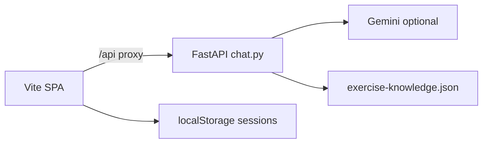

# Product Requirements Document: Jarvis (Gym Voice Assistant)

| Field | Value |
|--------|--------|
| Product name | Jarvis |
| Tagline | Voice-first gym assistant |
| Primary client (this PRD) | Web app (`frontend/`, Vite) |
| Related | Expo / React Native app in same monorepo (feature parity not assumed) |

---

## 1. Overview

**Jarvis** is a **voice-first** gym assistant. The primary interaction mode is spoken natural-language commands, with text as fallback. Jarvis combines this with **structured workout state**: saved exercise plans per muscle, active sessions, set logging, and history. The web experience is a phone-style shell with **Home** (training feed), **Trainer** (coach chat + live tracker), and **Workout** (plan editor).

The backend augments rule-based answers from a **static knowledge file** with optional **Google Gemini** for broader coaching, and optional **ElevenLabs** text-to-speech via the API.

---

## 2. Problem statement

Generic chat apps are not tuned for gym workflows (log sets, muscle groups, progression). Spreadsheets are awkward mid-session. Jarvis targets **hands-free sessions first**: users should not need to manually type or edit forms during a set unless they choose to. The product prioritizes **voice continuity**, **repeatable plans**, and **explainable** exercise guidance grounded in a curated knowledge base when possible.

---

## 3. Goals

- Start, run, and **finish** workouts with clear muscle focus and planned exercises.
- Keep workout interaction **voice-first** so users can operate mid-session without manual typing.
- **Log sets** with natural phrases (weight, reps, sets, exercise name).
- **Ask** training questions via the Trainer; prefer **knowledge-backed** answers when the backend is available.
- **Compare** the last two completed sessions for a given muscle with analysis and a side-by-side UI.
- **Persist** plans and completed sessions **locally** in the browser (`localStorage`).
- **Optional** cloud AI (Gemini) and **optional** premium TTS (ElevenLabs) behind environment configuration.

### Non-goals

- Medical diagnosis, injury treatment, or replacing a clinician (prompts steer away from medical claims).
- Multi-user accounts, cloud sync, or social features in the current repository scope.
- Guaranteed offline LLM behavior without API keys and network.

---

## 4. Target users

| Persona | Needs |
|--------|--------|
| Gym regular | Fast logging, muscle-specific history, progression cues |
| Beginner | Simple commands, exercise ideas from knowledge + coach |
| Self-hoster / developer | Run Vite + FastAPI locally, configure `.env`, inspect `/health` |

---

## 5. Platforms and repositories

| Layer | Location | Notes |
|--------|-----------|--------|
| Web UI | `frontend/` | Vite entry; vanilla JS (`app.js`), HTML, CSS |
| Dev server | `npm run site:dev` | Proxies `/api` to backend (see `frontend/vite.config.js`) |
| Backend | `backend/chat.py` | FastAPI app: `/api/chat`, `/api/coach`, `/api/tts`, `/health` |
| Knowledge | `knowledge-base/exercise-knowledge.json` | Muscles, exercises, guide sections |
| Mobile | Expo / `App.tsx` (etc.) | Parallel client; not identical to the Vite bundle |

---

## 6. Architecture (high level)

- The **browser** never reads `exercise-knowledge.json` directly; the **Python** service loads it and applies heuristics / LLM prompts.
- **Session data** (plans, completed workouts, optional active session) lives in **localStorage** keys defined in `frontend/app.js` (`STORAGE`).

---

## 7. Functional requirements

Requirements are numbered for traceability. Implementation references are indicative.

### 7.1 Navigation and shell

| ID | Requirement |
|----|----------------|
| FR-01 | User can switch among **Home**, **Trainer**, and **Workout** without losing local state. |
| FR-02 | Trainer shows status for session activity and mic where applicable. |

### 7.2 Exercise plan (Workout tab)

| ID | Requirement |
|----|----------------|
| FR-03 | User can choose **three default exercises per muscle** from curated lists. |
| FR-04 | User can **save** the plan; values merge into storage and load on next visit. |

### 7.3 Workout session lifecycle

| ID | Requirement |
|----|----------------|
| FR-05 | User can **start** a workout flow (e.g. “start workout” or naming muscles) when no conflicting state blocks it. |
| FR-06 | Starting a session associates **muscle groups** and **planned exercises** from saved defaults where used. |
| FR-07 | **Active** session is visible on Home (banner) and Trainer (live tracker). |
| FR-08 | User can **end** the workout so it is appended to **history** and cleared from “active.” |
| FR-08a | During an active session, all key actions (start/log/adjust/compare/end) should be available through **voice commands**; typed input is fallback, not required. |

### 7.4 Logging

| ID | Requirement |
|----|----------------|
| FR-09 | User can **log sets** via natural language (`parseLog` / `logSet` in `frontend/app.js`): weight (e.g. kg), reps, optional set count, exercise fragment. |
| FR-10 | **Volume** for a session is the sum over entries of **weight × reps** (each stored entry is one performed set). |
| FR-11 | **Display** of sets in Home preview and compare views **groups consecutive** identical exercise + weight + reps into one line (e.g. `× N sets`) via `aggregateEntriesForDisplay` / `formatGroupedSetLine`. |

### 7.5 Coach and APIs

| ID | Requirement |
|----|----------------|
| FR-12 | Trainer messages are sent to **`POST /api/coach`**, with fallback to **`POST /api/chat`** when needed. |
| FR-13 | Without Gemini, coach uses **knowledge heuristics** and small-talk shortcuts where implemented in `backend/chat.py`. |
| FR-14 | With **`GEMINI_API_KEY`**, coach can use Gemini for broader answers while remaining gym-oriented. |
| FR-15 | When the API is unreachable, the user sees an explicit **connectivity** hint (frontend), not only generic copy. |

### 7.6 Compare last two workouts

| ID | Requirement |
|----|----------------|
| FR-16 | User can ask to **compare** a muscle (e.g. phrasing including “compare” and a recognizable muscle term). |
| FR-17 | If at least **two completed** sessions exist for that muscle, the app shows **analysis** (voice + Trainer text) and renders **last vs previous** in the Live Exercise Tracker (`compareView`, `renderCompareViewHtml`). |
| FR-18 | If fewer than two sessions exist, the user gets a clear message and the tracker stays in the default empty state. |

### 7.7 Voice and TTS

| ID | Requirement |
|----|----------------|
| FR-19 | Where supported, user can use **speech recognition** to fill input and run the same command pipeline. |
| FR-19a | Voice mode is the default product posture: users should be able to complete a full session without needing to manually add/edit fields in the UI. |
| FR-20 | **Browser** TTS is the default for reading replies. |
| FR-21 | When **`VITE_USE_BACKEND_TTS`** is `"true"` and ElevenLabs credentials are set on the server, replies can use **`POST /api/tts`** (MP3 playback). |

### 7.8 Summaries and progress

| ID | Requirement |
|----|----------------|
| FR-22 | User can request **summary / improvement** style answers for a muscle when **history** supports it (see `summarizeLastWorkoutForMuscle`, `summarizeImprovementForMuscle`). |

---

## 8. Non-functional requirements

| ID | Requirement |
|----|----------------|
| NFR-01 | **Secrets** (Gemini, ElevenLabs) are loaded from environment / `.env`, not committed to the repository. |
| NFR-02 | **`GET /health`** returns `gemini_configured` (boolean) without exposing key material. |
| NFR-03 | **Project root `.env`** then **`backend/.env`** are loaded in order so keys can live in either place (`backend/chat.py`). |
| NFR-04 | Scrollable pages use **subtle** scrollbar styling for readability (`frontend/styles.css`). |

---

## 9. Configuration reference

| Variable | Role |
|----------|------|
| `GEMINI_API_KEY` or `EXPO_PUBLIC_GEMINI_API_KEY` | Enables Gemini paths when set |
| `GEMINI_MODEL` | Model id (default in code e.g. `gemini-2.0-flash`) |
| `ELEVENLABS_API_KEY`, `ELEVENLABS_VOICE_ID`, `ELEVENLABS_MODEL_ID` | Used by `/api/tts` |
| `VITE_USE_BACKEND_TTS` (Vite / root `.env`) | When `"true"`, web client uses backend TTS |

See `backend/.env.example` and project `.env.example` for templates.

---

## 10. Roadmap / backlog (not committed in PRD scope)

The following have been discussed as product ideas; verify the codebase before treating as shipped:

- **Pause Jarvis** / resume: free-form chat without workout shortcuts mid-flow.
- **Delete** a workout from history or **discard** active session from UI.
- Parity matrix between **Expo** and **Vite** clients.

---

## 11. Success metrics (suggested)

- User can **start → log → end** a session without errors on a standard local setup (Vite + backend).
- Coach responses return within acceptable latency on localhost when Gemini is enabled.
- No API keys in tracked source files; `.env` gitignored as usual.

---

## 12. Document history

| Version | Date | Notes |
|---------|------|--------|
| 1.0 | — | Initial PRD aligned to monorepo structure and `frontend/app.js` / `backend/chat.py` |
